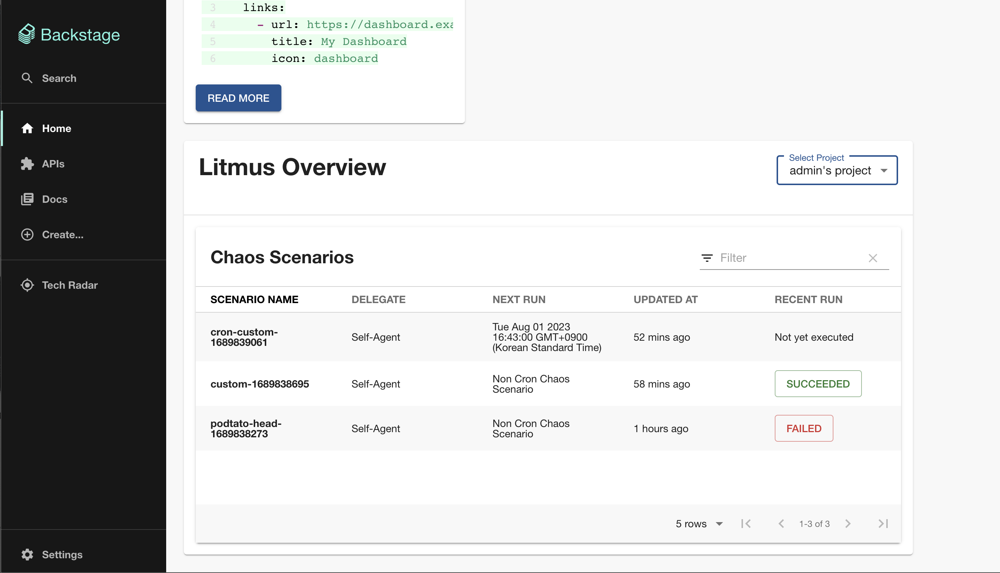
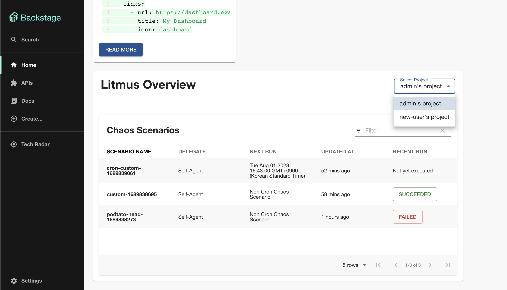
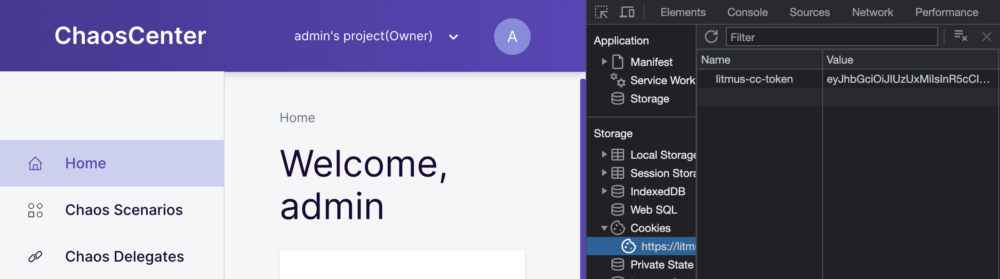

# backstage-plugin-litmus

> This plugin not published yet.

https://github.com/namkyu1999/backstage-plugin-litmus/assets/53862866/4eb82654-85f4-4c3a-9003-fb09415d72a2

## Features

### Litmus Overview

You can view chaos scenarios with recent chaos scenario runs. Clicking Recent runs redirects the page to the litmus
chaos scenario run details page.


### Select Project

You can change project by select project name.


## Prerequisite

1. Get Litmus Auth Token in the cookie(cookie name: litmus-cc-token)
   
   > More convenient way to get token will be provided later
2. In the `app-config.yaml` file root directory, add litmus proxy and info like below
    ```yaml
    proxy:
      '/litmus':
        target: 'https://litmus.namkyupark.tech'
        changeOrigin: true
    litmus:
      baseURL: LITMUS_DOMAIN
      apiToken: LITMUS_AUTH_TOKEN
    ```

## Add Litmus plugin to Backstage

TBA (Added after deploying to NPM)